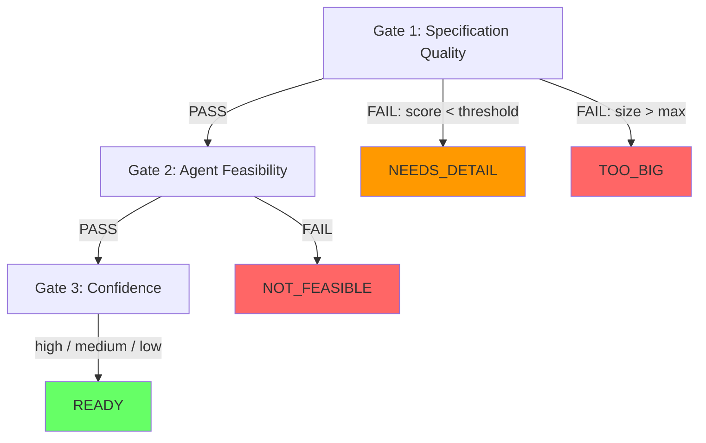
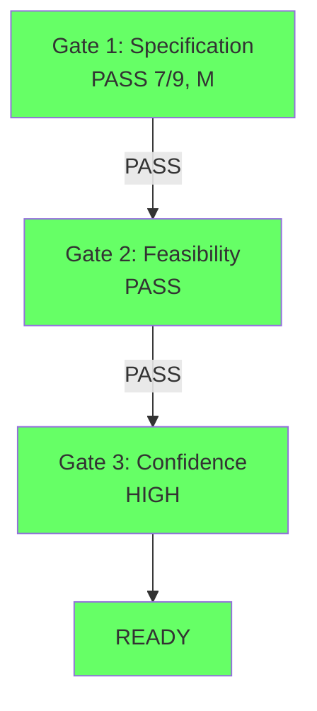
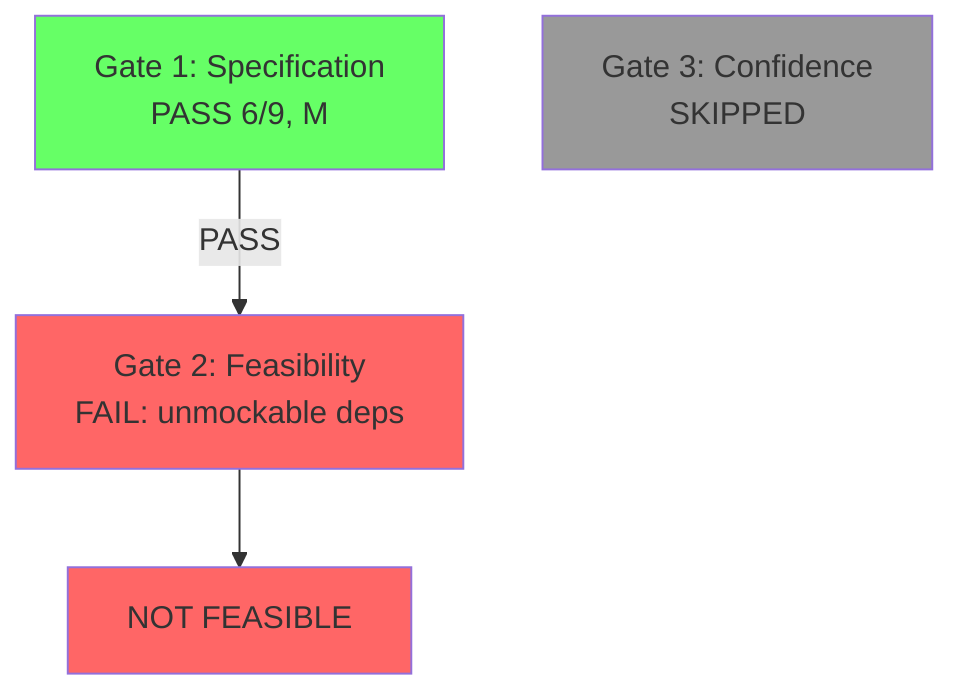

# Triage Gates & Confidence — Design Spec

## Problem

The current triage system evaluates specification quality and size, but doesn't answer two critical questions:
1. **Should the agent tackle this?** — a well-specified ticket may still be infeasible (unmockable dependencies, needs human decisions, too ambiguous)
2. **How confident is the agent?** — even feasible tickets vary in likelihood of producing a mergeable PR

The outcome lacks a decision trace, making it hard to understand *why* a verdict was reached.

## Solution

Restructure triage as three sequential gates evaluated in a single Claude call, with a deterministic decision trace (text + mermaid diagram) appended to every report.

## Gate Structure



### Gate 1: Specification Quality (existing, unchanged)

Three criteria scored 0-3:
- **acceptance_clarity**: Are acceptance criteria explicit and testable?
- **scope_boundedness**: Is the scope well-defined and contained?
- **technical_detail**: Is enough technical context provided?

Plus size estimate (S/M/L/XL).

**Pass:** total >= threshold (default 6) AND size <= maxSize (default L)
**Fail (needs_detail):** total < threshold
**Fail (too_big):** size > maxSize or size == XL

### Gate 2: Agent Feasibility (new)

Three boolean signals:
- **unmockable_dependencies**: Needs real external systems that cannot be simulated — production databases, hardware, third-party APIs without sandbox environments
- **human_dependency**: Requires design decisions, stakeholder sign-off, or cross-team coordination before coding can begin
- **ambiguity_overload**: Agent would need to ask 3+ clarifying questions before it could start implementation

**Pass:** all three are false
**Fail (not_feasible):** any signal is true

Claude provides a one-sentence `reasoning` per signal explaining the assessment.

### Gate 3: Confidence Assessment (new)

Only evaluated if gates 1 and 2 pass.

| Level | Meaning | Action |
|-------|---------|--------|
| **high** | Agent can implement and open PR autonomously. No questions needed. | Auto-queue eligible |
| **medium** | Agent can implement but will likely need 1 round of human review on approach. | Queue with review flag |
| **low** | Too many unknowns — agent would spend more time asking than coding. | Don't queue, explain why |

Claude provides a one-sentence `confidence_reasoning` justifying the level.

## Verdict Types

```ts
type TriageVerdict = "ready" | "needs_detail" | "too_big" | "not_feasible";
```

`evaluateVerdict` logic (order matters):
1. size > maxSize or XL → `too_big`
2. score < threshold → `needs_detail`
3. any feasibility signal true → `not_feasible`
4. else → `ready`

## Data Model Changes

### TriageResult (Claude's JSON output)

```ts
interface TriageResult {
  // Existing fields
  criteria: {
    acceptance_clarity: number;  // 0-3
    scope_boundedness: number;   // 0-3
    technical_detail: number;    // 0-3
  };
  total: number;
  max: 9;
  size: "S" | "M" | "L" | "XL";
  verdict: string;              // one-sentence assessment
  concerns: string;
  suggested_files: string[];

  // New fields
  feasibility: {
    unmockable_dependencies: boolean;
    human_dependency: boolean;
    ambiguity_overload: boolean;
    reasoning: string;          // one sentence per signal
  };
  confidence: "high" | "medium" | "low";
  confidence_reasoning: string; // one sentence justification
}
```

### TriageReport

```ts
interface TriageReport {
  issue: JiraIssue;
  result: TriageResult;
  verdict: TriageVerdict;
  confidence?: "high" | "medium" | "low"; // only set when verdict is "ready"
  timestamp: string;
}
```

## Prompt Changes

The `buildTriagePrompt` function adds two new sections after the existing scoring rubric:

**Agent Feasibility section:**
```
## Agent Feasibility
Evaluate whether an AI coding agent can tackle this issue autonomously:

- unmockable_dependencies (true/false): Does this require real external systems
  that cannot be mocked or simulated? (prod databases, hardware, third-party
  APIs without sandbox)
- human_dependency (true/false): Does this require design decisions, stakeholder
  sign-off, or cross-team coordination before coding can begin?
- ambiguity_overload (true/false): Would the agent need to ask 3+ clarifying
  questions before it could start?

If any Gate 1 criterion scores 0-1, or size is XL, skip this section and output
null for feasibility and confidence fields.
```

**Confidence section:**
```
## Confidence Assessment
If all feasibility signals are false, rate your confidence that an AI agent
can produce a mergeable PR on the first try:

- high: Straightforward implementation, clear patterns, no unknowns
- medium: Implementable but likely needs one round of human review on approach
- low: Significant unknowns that would slow the agent down
```

**Updated JSON output schema** includes the new `feasibility`, `confidence`, and `confidence_reasoning` fields.

## Decision Trace

Every triage report gets a decision trace — both text and mermaid diagram, generated deterministically from the structured gate results (not by Claude).

### Text Trace (in markdown report)

```markdown
## Decision Trace
- Gate 1 (Specification): PASS — score 7/9, size M
- Gate 2 (Feasibility): PASS — no unmockable deps, no human deps, low ambiguity
- Gate 3 (Confidence): HIGH — well-scoped CRUD, familiar patterns
→ Verdict: READY | Confidence: HIGH
```

For a failed gate, the trace short-circuits:
```markdown
## Decision Trace
- Gate 1 (Specification): PASS — score 6/9, size M
- Gate 2 (Feasibility): FAIL — unmockable dependencies (requires prod Stripe API)
→ Verdict: NOT_FEASIBLE
```

### Mermaid Diagram (in markdown report)

Generated from gate results. Passing gates are green, the failing gate is red, skipped gates are grey.

Example (all pass):


Example (gate 2 fails):


## Notification Changes

### Ready verdict
**Before:** `Score: 7/9 (High) | Size: M | 3 file(s) — Ready for implementation`
**After:** `Score: 7/9 | Size: M | Confidence: high | 3 file(s)`

- Replaces hardcoded "High/Medium" label with actual confidence from gate 3
- "Approve" action button shown for high and medium confidence
- Low confidence: no Approve button, message says "Low confidence — review recommended"

### Not feasible verdict (new)
`Not feasible — [reason from feasibility.reasoning]`
- Links to Jira issue (click opens browser)
- No Approve button

### Needs detail / Too big
Unchanged.

### Notification routing (run.ts)
```ts
if (report.verdict === "ready") {
  await notifyAction.notifyTriage(issue, report);
} else if (report.verdict === "needs_detail") {
  await notifyAction.notifyNeedsDetail(issue, report);
} else if (report.verdict === "not_feasible") {
  await notifyAction.notifyNotFeasible(issue, report);  // NEW
} else {
  await notifyAction.notifyTooBig(issue, report);
}
```

## CLI Changes (triage.ts)

The `triage` CLI command displays the enriched report including:
- Gate results with pass/fail status
- Confidence level (when ready)
- Decision trace (text)
- Mermaid diagram (rendered by `bat` if it supports markdown, otherwise raw)

Approve prompt only shown when verdict is `ready` and confidence is `high` or `medium`.

## Files to Change

| File | Change |
|------|--------|
| `src/types.ts` | Add `feasibility`, `confidence`, `confidence_reasoning` to `TriageResult`; add `not_feasible` to `TriageVerdict`; add `confidence` to `TriageReport` |
| `src/actions/triage.ts` | Update `buildTriagePrompt` with feasibility + confidence sections; update `evaluateVerdict` with gate 2 logic; add `buildDecisionTrace` and `buildMermaidDiagram` helpers; update `saveReport` |
| `src/actions/notify.ts` | Add `notifyNotFeasible` method; update `notifyTriage` to show confidence |
| `src/cli/triage.ts` | Show confidence; conditionally show approve prompt |
| `src/cli/run.ts` | Route `not_feasible` verdict to new notification method |
| `test/actions/triage.test.ts` | Tests for new gate logic, verdict evaluation, trace generation |
| `test/actions/notify.test.ts` | Tests for new notification method |

## Out of Scope

- Multi-call gate evaluation (decided against — single call is simpler)
- Auto-queueing based on confidence (future enhancement)
- Persisting decision traces to a separate analytics store
