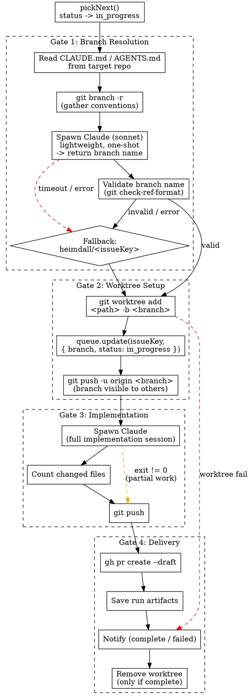

# Worker Branch Resolution Design

**Date:** 2026-04-21
**Status:** Approved

## Problem

The worker hardcodes branch names as `heimdall/<issueKey>`. This ignores per-repo branching conventions (e.g. `feature/KEY-title`, `bugfix/KEY-title`). The branch should follow whatever convention the target repo uses, and be pushed early so others can collaborate on it.

## Solution

Add a **Gate 1: Branch Resolution** step before worktree creation. A lightweight Claude call reads the repo's docs and existing branches, then returns the appropriate branch name. The worker validates it and falls back to `heimdall/<issueKey>` on failure.

## Workflow



## Branch Resolution Prompt

**Inputs gathered programmatically by the worker:**
- Contents of `CLAUDE.md` and/or `AGENTS.md` from the repo's `cwd` (if they exist)
- Output of `git branch -r` (remote branches, capped at last ~50 lines)
- Issue key, title, and issue type from the queue item

**Prompt template:**

```
You are deciding the git branch name for a new issue.

## Issue
Key: {issueKey}
Title: {title}
Type: {issueType}

## Repository conventions
{claudeMdContent || "No CLAUDE.md found."}

{agentsMdContent || "No AGENTS.md found."}

## Existing branches
{branchList}

Based on the repository's documented conventions and existing branch naming patterns,
reply with ONLY the branch name. Nothing else.
```

**Parsing:**
1. Take first non-empty line from response, trim whitespace
2. Validate with `git check-ref-format --branch <name>`
3. If invalid or empty, fall back to `heimdall/<issueKey>`

**Model:** Uses `config.triage.model` (sonnet by default) — cheap and fast for a trivial task.

**Timeout:** 30 seconds. On timeout, fall back to default.

## Early Push (Collaborative Branch)

Gate 2 pushes the branch to origin immediately after worktree creation, before the implementation session starts. This means:
- The branch is visible on GitHub from the start
- Anyone can check it out and contribute fixes/changes while the worker is running
- The final push in Gate 3 just pushes new commits on top

## Type Changes

### `QueueItem` — add `issueType`

```ts
export interface QueueItem {
  // ... existing fields ...
  issueType?: string;  // NEW: "Bug", "Story", "Task", etc.
}
```

Populated from `report.issue.issueType` in `approve.ts` when the queue item is created. Optional for backwards compatibility with existing queue items.

## File Changes

| File | Change |
|------|--------|
| `src/types.ts` | Add `issueType?: string` to `QueueItem` |
| `src/worker.ts` | Add `resolveBranchName()`, `gatherBranchContext()` methods. Update `processNext()` to call resolution before worktree, push branch immediately after worktree. |
| `src/approve.ts` | Pass `issueType: report.issue.issueType` when building `QueueItem` |

No new files. No new dependencies.
